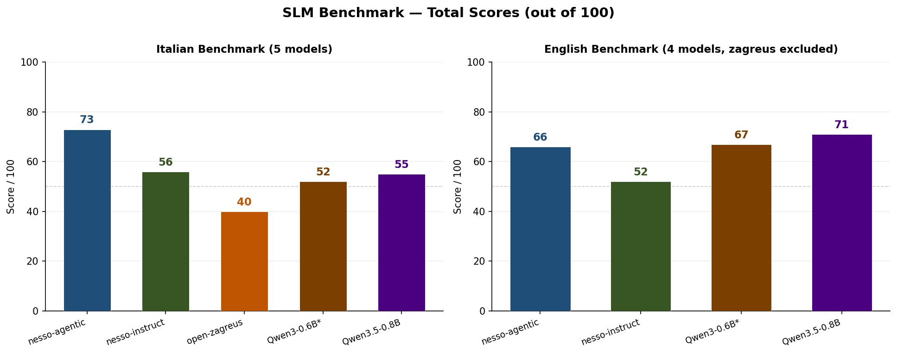
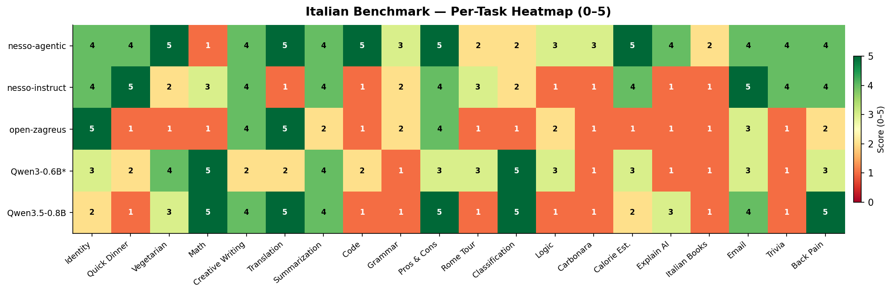
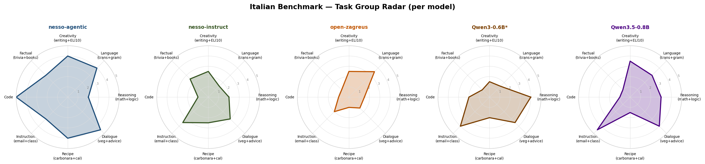
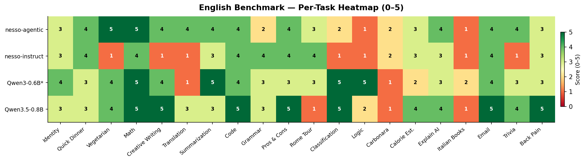
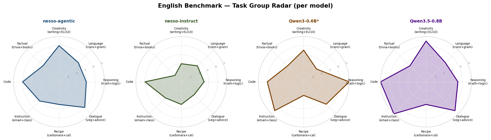
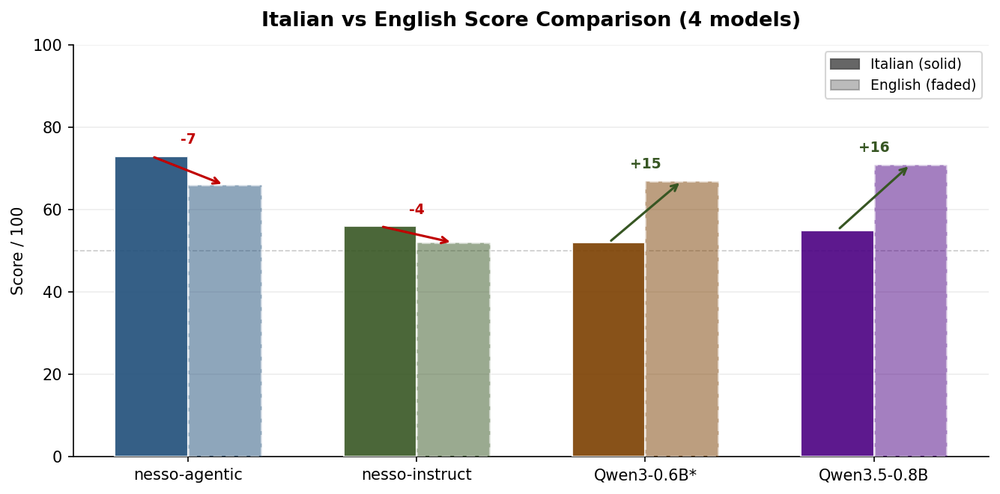
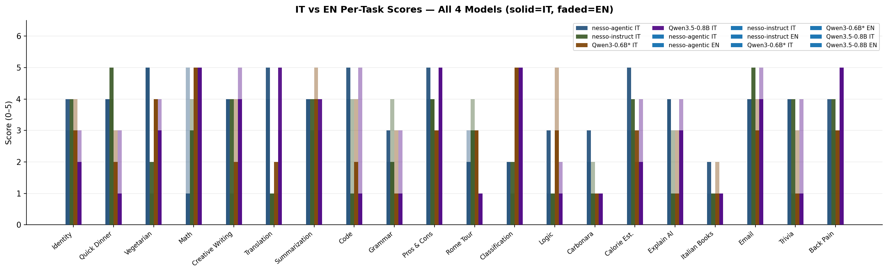
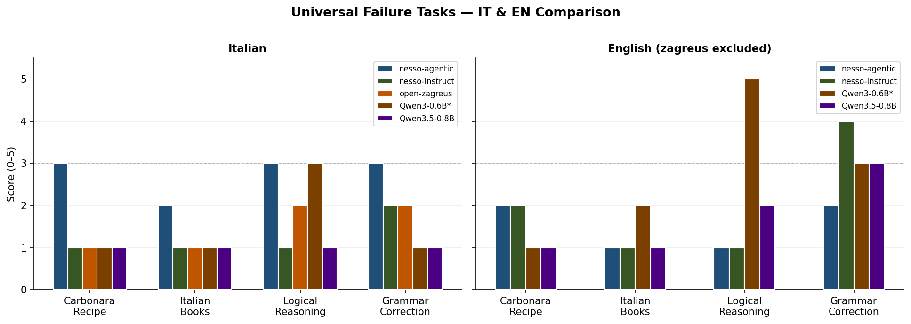

# The Joy and Pain of Training an LLM from Scratch

### A Technical Report on the Development of the Zagreus and Nesso Model Families

---
## Table of Contents

1. [The Joy and Pain of Training an LLM from Scratch](#the-joy-and-pain-of-training-an-llm-from-scratch)
2. [1. Motivation: The Vision of Sovereign Edge Intelligence](#1-motivation-the-vision-of-sovereign-edge-intelligence)
3. [2. Technology Stack: Framework Selection](#2-technology-stack-framework-selection)
   - [Framework Comparative Analysis](#framework-comparative-analysis)
   - [Our Choice: Hugging Face Nanotron](#our-choice-hugging-face-nanotron)
4. [3. Data Engineering: The Tokenization Pipeline](#3-data-engineering-the-tokenization-pipeline)
   - [Dataset Sources](#dataset-sources)
   - [The Tokenization Process](#the-tokenization-process)
5. [4. Pre-training: The Core Engine](#4-pre-training-the-core-engine)
   - [Nanotron Training Configuration](#nanotron-training-configuration)
   - [Slurm Execution](#slurm-execution)
   - [Model Conversion](#model-conversion)
6. [5. Post-Training: Shaping Behavior](#5-post-training-shaping-behavior)
   - [Post-Training Slurm Script](#post-training-slurm-script)
   - [Axolotl Configuration](#axolotl-configuration)
7. [6. Pre-trained Foundational Models Evaluations](#6-pre-trained-foundational-models-evaluations)
   - [Zagreus-0.4B-ita-base](#zagreus-04b-ita-base)
   - [Zagreus-0.4B-spa-base (Spanish)](#zagreus-04b-spa-base-spanish)
   - [Zagreus-0.4B-fra (French)](#zagreus-04b-fra-french)
   - [Zagreus-0.4B-por (Portuguese)](#zagreus-04b-por-portuguese)
   - [lm-evaluation-harness-pt](#lm-evaluation-harness-pt)
8. [7. Post-Trained Nesso Models Evaluations](#7-post-trained-nesso-models-evaluations)
   - [Open-Nesso-0.4B Evaluation](#open-nesso04b-evaluation)
9. [8. Conclusion](#8-conclusion)
---
## 1. Motivation: The Vision of Sovereign Edge Intelligence

Training a fully functional modern neural network, specifically a Large Language Model (LLM), from first principles has been a foundational ambition since the inception of our community [mii-llm](https://mii-llm.ai) that stands for Made in Italy - Large Language Model. In the current landscape, the convergence of distributed computing power and accessible knowledge has never been more potent; consequently, constructing an intelligent machine stands as one of the most exciting tasks a group of machine learning specialists can undertake.

This vision materialized when Antonio Baldassarra (CEO of Seeweb) and Marco Cristofanilli (Head of AI at Seeweb) commissioned us to develop a Small Language Model (SLM) from scratch utilizing the Seeweb infrastructure. Seeweb, a cloud provider with a strategic focus on AI, granted us access to a cluster of on-demand nodes comprising a total of 64 NVIDIA A100 GPUs.

Our primary objective was to experiment and deliver a state-of-the-art SLM with approximately 500 million parameters, built from the ground up and optimized for edge use cases within some of the romance languages ecosystem, in particular Italian, Spanish, Portuguese and French. We hypothesize that, in the coming years, intelligent devices and virtually any hardware equipped with a chip will be enhanced by neural architectures with embedded reasoning and language capabilities. Small, efficient models will be key to enabling automation at the edge. To address this need, we created four foundation language models,  the  Zagreus family, and three different finetuned models, the Nesso family, arguably one of the few high-performing small language models dedicated to the European languages.

In the spirit of open and reproducible research, we are releasing the full Zagreus and Nesso lineup: seven models in total: four base (pretrained) checkpoints for bilingual models and three post-trained variants. Notably, our post-trained models are designed to compete on standard benchmarks with state of the art models of comparable size, demonstrating that carefully engineered small models can achieve near frontier-level performance within their parameter class.

### Base models:

* [zagreus-0.4B-base-ita]() English Italian bilingual model
* [zagreus-0.4B-base-spa]() English Spanish bilingual model
* [zagreus-0.4B-base-por]() English Portuguese bilingual model
* [zagreus-0.4B-base-fra]() English French bilingual model

### Post-trained models:
* [Nesso-0.4B-instruct]() English Italian for conversational use cases
* [Nesso-0.4B-agentic]() English Italian for agentic and function calling use cases
* [Open-Zagreus-0.4B]() Fully open source data used to train this model


We are releasing this detailed blog post, covering every step and data point required to reproduce and evaluate the project, as we strongly believe in the importance of open source in reducing technological and geopolitical dependencies.

---

## 2. Technology Stack: Framework Selection

There are numerous frameworks available for creating an LLM from scratch. We conducted a comparative analysis of several options. Below is a summary of our testing and the rationale behind our ultimate decision to utilize Nanotron by Hugging Face.

### Framework Comparative Analysis

[**Megatron-LM:**](https://github.com/NVIDIA/Megatron-LM) Developed by NVIDIA, this is a powerful framework designed for training large transformer models with billions of parameters. While it is likely an optimal choice for large, well resourced teams, we found it challenging to set up and deploy effectively on our specific cluster infrastructure.

[**Llama-Factory:**](https://github.com/hiyouga/LLaMA-Factory) A versatile and user friendly open-source framework that simplifies fine-tuning, training, and deployment of a wide range of LLMs. However, our evaluation suggests it is more specialized for fine-tuning than for pre-training from scratch.

**nanoGPT and nanochat:** Both created by Andrej Karpathy, these projects prioritize simplicity and educational value.

[**nanoGPT**](https://github.com/karpathy/nanoGPT) is a minimalist, readable codebase designed as a learning tool, though it is now considered deprecated in favor of its successor.
[**nanochat**](https://github.com/karpathy/nanochat) is the evolution of nanoGPT, offering a full-stack, end-to-end pipeline for building a complete ChatGPT-like chatbot. It covers the entire lifecycle, from tokenization and pre-training to fine-tuning and a web interface, all within a compact and hackable codebase. Although nanochat had not yet been released when we commenced this project, we believe it has a promising future, especially given its recent integration into the Transformers library.

### Our Choice: Hugging Face Nanotron

Ultimately, we selected [Hugging Face Nanotron](https://github.com/huggingface/nanotron). It is a minimalistic library focused on 3D parallelism (Data, Tensor, and Pipeline) specifically for pre-training transformer models. We value Hugging Face for its commitment to openness. We found the library well-suited for multi-node training; furthermore, it is natively integrated into the Hugging Face ecosystem (Accelerate, Datasets, hf-cli), ensuring that workflows from data tokenization to model release remain cohesive.

During the development cycle, we identified minor bugs and are actively contributing to the library via Pull Requests. We also established a [fork of Nanotron](https://github.com/mii-llm/nanotron) optimized to run directly on a Slurm cluster.


## 3. Data Engineering: The Tokenization Pipeline

Data is the *sine qua non* for creating an LLM. The volume of data required is contingent upon the target model size and the available compute budget. Operating as a GPU-constrained team and thanks to the sponsorship from Seeweb; we chose to build a small language model of ~500 million parameters, trained on approximately 1 trillion tokens.

### Dataset Sources

We utilized exclusively open source datasets by the Hugging Face team for creating our four bilingual foundational model released . Below is the data distribution per model:

**mii-llm/nesso-0.4B-ita:**
* [https://huggingface.co/datasets/HuggingFaceFW/fineweb/viewer/sample-350BT](https://huggingface.co/datasets/HuggingFaceFW/fineweb/viewer/sample-350BT) (350 billion tokens)
* [https://huggingface.co/datasets/HuggingFaceFW/fineweb-2/viewer/ita_Latn](https://huggingface.co/datasets/HuggingFaceFW/fineweb-2/viewer/ita_Latn)
* [https://huggingface.co/datasets/HuggingFaceFW/finepdfs/viewer/ita_Latn](https://huggingface.co/datasets/HuggingFaceFW/finepdfs/viewer/ita_Latn)
* [https://huggingface.co/datasets/bigcode/starcoderdata](https://huggingface.co/datasets/bigcode/starcoderdata) (250 billion tokens)

**mii-llm/nesso-0.4B-fra:**
* [https://huggingface.co/datasets/HuggingFaceFW/fineweb/viewer/sample-350BT](https://huggingface.co/datasets/HuggingFaceFW/fineweb/viewer/sample-350BT) (350 billion tokens)
* [https://huggingface.co/datasets/HuggingFaceFW/fineweb-2/viewer/fra_Latn](https://huggingface.co/datasets/HuggingFaceFW/fineweb-2/viewer/fra_Latn)
* [https://huggingface.co/datasets/HuggingFaceFW/finepdfs/viewer/fra_Latn](https://huggingface.co/datasets/HuggingFaceFW/finepdfs/viewer/fra_Latn)
* [https://huggingface.co/datasets/bigcode/starcoderdata](https://huggingface.co/datasets/bigcode/starcoderdata) (250 billion tokens)

**mii-llm/nesso-0.4B-por:**
* [https://huggingface.co/datasets/HuggingFaceFW/fineweb/viewer/sample-350BT](https://huggingface.co/datasets/HuggingFaceFW/fineweb/viewer/sample-350BT) (350 billion tokens)
* [https://huggingface.co/datasets/HuggingFaceFW/fineweb-2/viewer/por_Latn](https://huggingface.co/datasets/HuggingFaceFW/fineweb-2/viewer/por_Latn)
* [https://huggingface.co/datasets/HuggingFaceFW/finepdfs/viewer/por_Latn](https://huggingface.co/datasets/HuggingFaceFW/finepdfs/viewer/por_Latn)
* [https://huggingface.co/datasets/bigcode/starcoderdata](https://huggingface.co/datasets/bigcode/starcoderdata) (250 billion tokens)

**mii-llm/nesso-0.4B-spa:**
* [https://huggingface.co/datasets/HuggingFaceFW/fineweb/viewer/sample-350BT](https://huggingface.co/datasets/HuggingFaceFW/fineweb/viewer/sample-350BT) (350 billion tokens)
* [https://huggingface.co/datasets/HuggingFaceFW/fineweb-2/viewer/spa_Latn](https://huggingface.co/datasets/HuggingFaceFW/fineweb-2/viewer/spa_Latn)
* [https://huggingface.co/datasets/HuggingFaceFW/finepdfs/viewer/spa_Latn](https://huggingface.co/datasets/HuggingFaceFW/finepdfs/viewer/spa_Latn)
* [https://huggingface.co/datasets/bigcode/starcoderdata](https://huggingface.co/datasets/bigcode/starcoderdata) (250 billion tokens)

### The Tokenization Process

Raw datasets are not ready for immediate training; they must first be tokenized. Tokenization is a CPU intensive process that transforms text strings into token sequences (numerical IDs). As a rule of thumb for storage estimation, for every 1 GB of text, approximately 3 GB of tokenized outputs are generated. For ~1 trillion tokens, one typically requires at least 3 to 5 terabytes of disk space (depending on format, sharding strategy, and compression).

We selected the Llama-3.2 tokenizer (from the Llama-3.2-1B model) because its multilingual tokenization capabilities are robust and widely adopted. Using the [datatrove](https://github.com/huggingface/datatrove) library, the process took over three weeks of continuous computation to generate ~1 trillion tokens, stratified as roughly 400B English, 400B Italian, and 200B Code.

Below is the Python script as example used for Slurm pipeline execution:

```python
import os
import sys
from pathlib import Path
from datatrove.pipeline.readers import ParquetReader
from datatrove.pipeline.tokens import DocumentTokenizer
from datatrove.executor import SlurmPipelineExecutor

def create_and_run_tokenization_job(input_dir, base_output_dir):
    """
    Create and execute a tokenization pipeline for a specific directory.
    """
    dir_name = os.path.basename(input_dir)
    output_dir = os.path.join(base_output_dir, f"tokenized_{dir_name}")
    
    # Create output directory if it doesn't exist
    os.makedirs(output_dir, exist_ok=True)
    
    # Create pipeline for tokenization
    pipeline = [
        ParquetReader(
            data_folder=input_dir,
            glob_pattern="*.parquet",
            text_key="text",
        ),
        DocumentTokenizer(
            tokenizer_name_or_path="/hub/models--meta-llama--Llama-3.2-1B",
            output_folder=output_dir,
            local_working_dir=dir_name,
            save_filename=f"{dir_name}_tokenized",
            shuffle_documents=False,
        ),
    ]
    # Configure and run the SLURM executor
    executor = SlurmPipelineExecutor(
        job_name=f"tokenize_{dir_name}",
        pipeline=pipeline,
        tasks=1,
        workers=-1,
        time="24:00:00",
        partition="boost_usr_prod",
        logging_dir=os.path.join(output_dir, f"{dir_name}_logs"),
        mem_per_cpu_gb=16,
        slurm_logs_folder=os.path.join(output_dir, f"{dir_name}_slurm_logs"),
        # also pass the SBATCH gres directive to ensure 0 GPUs allocated
        sbatch_args={
            "account": "YOUR_ACCOUNT",
            "gres": "gpu:0",
        },
    )
    
    executor.run()

def main():
    # Base paths
    base_input_path = "INPUT_DIR"
    base_output_path = "OUTPUTDIR”
    
    # List of directories to process
    # Discover directories under base_input_path instead of using a static list
    try:
        entries = os.listdir(base_input_path)
    except FileNotFoundError:
        print(f"Base input path {base_input_path} not found")
        directories = []
    else:
        directories = sorted(
            [
                name
                for name in entries
                if os.path.isdir(os.path.join(base_input_path, name)) and name.startswith("CC-MAIN")
            ]
        )
    
    # Process each directory
    # if i need other 20 directories
    # dir_name in directories[20:40]: 
    for dir_name in directories[60:]:  # Example: limit to first 20 directories
        input_dir = os.path.join(base_input_path, dir_name)
        if os.path.exists(input_dir):
            print(f"Launching tokenization job for {dir_name}")
            create_and_run_tokenization_job(input_dir, base_output_path)
        else:
            print(f"Warning: Directory {input_dir} does not exist, skipping...")

if __name__ == "__main__":
    main()
```

---

## 4. Pre-training: The Core Engine

Pre-training is the foundational step in building an LLM, transforming raw tokenized data into a model capable of context aware text completion. This is the most time consuming and GPU intensive phase. While massive models may require thousands of GPUs, our sub 1 billion parameter model was effectively trained on the 64 GPU cluster provided by Seeweb.

We utilized Nanotron, which supports multiple architectures, including Llama-3.2, Qwen-2.5, and Mixture-of-Experts (MoE) variants. For this project, we adopted a modified Llama-3.2 fully dense architecture. Our design choice was motivated by the hypothesis that, in the small-parameter regime (~500M parameters), fully dense models provide better compute utilization and more stable training dynamics than sparse architectures such as MoE. In tightly constrained capacity settings, the routing overhead and expert under-utilization typical of MoE architectures may offset their theoretical efficiency advantages.

Working with a GPU cluster is streamlined by HPC tools; we employed the Slurm scheduler. Slurm allows the cluster to be viewed as a unified Linux system where jobs can be executed across many GPUs in parallel, while handling checkpoints and logs in real time. The most challenging aspect remains ensuring the software stack from drivers and CUDA/NCCL to Python libraries, functions harmoniously, often requiring resolution of version and ABI incompatibilities.

Successfully running a distributed training job on the tokenized data was a profound milestone. Observing the loss curve decrease from raw data after days of waiting conveys the sense of operating at the edge of scientific and engineering capability a genuinely intense moment for a researcher.

For out-of-the-box functionality, we recommend our fork: [https://github.com/mii-llm/nanotron](https://github.com/mii-llm/nanotron) (a fork of [https://github.com/huggingface/nanotron/](https://github.com/huggingface/nanotron/)), pending the merge of our Pull Request.

### Nanotron Training Configuration

Below is the configuration used for the pre-training run:

```yaml
checkpoints:
  checkpoint_interval: 5000
  checkpoints_path: checkpoints_zagreus_ita_v2
  checkpoints_path_is_shared_file_system: false
resume_checkpoint_path: /training/pretraining/nanotron/checkpoints_zagreus_ita_v2/630000 
save_final_state: false
  save_initial_state: false
data_stages:
- data:
    dataset:
      dataset_folder:
      - /training/pretraining/fineweb-ita/tokenized
      - /training/pretraining/fineweb-edu-350BT/000_tokenized_output
      - /training/pretraining/fineweb-edu-350BT/011_tokenized_output
      - /training/pretraining/fineweb-edu-350BT/012_tokenized_output
      - /training/pretraining/fineweb-edu-350BT/013_tokenized_output
      - /training/pretraining/fineweb-edu-350BT/014_tokenized_output
      - /training/pretraining/fineweb-edu-350BT/015_tokenized_output
      - /training/pretraining/fineweb-edu-350BT/016_tokenized_output
      - /training/pretraining/finepdf-ita/000_tokenized_output
      - /training/pretraining/starcoder_tokenized/000_tokenized_output   
    num_loading_workers: 0
    seed: 8
  name: stable phase
  start_training_step: 1
general:
  benchmark_csv_path: null
  consumed_train_samples: null
  ignore_sanity_checks: true
  project: zagreus
  run: zagreus-350M
  seed: 8
  step: null
logging:
  iteration_step_info_interval: 1
  log_level: info
  log_level_replica: info
model:
  ddp_bucket_cap_mb: 100
  dtype: bfloat16
  init_method:
    std: 0.03227
  make_vocab_size_divisible_by: 1
  model_config:
    bos_token_id: 128000
    eos_token_id: 128001
    hidden_act: silu
    hidden_size: 960
    initializer_range: 0.02
    intermediate_size: 2560
    is_llama_config: true
    max_position_embeddings: 4096
    num_attention_heads: 15
    num_hidden_layers: 32
    num_key_value_heads: 5
    pad_token_id: null
    pretraining_tp: 1
    rms_norm_eps: 1.0e-05
    rope_interleaved: false
    rope_scaling: null
    rope_theta: 10000.0
    tie_word_embeddings: true
    use_cache: true
    vocab_size: 128256
optimizer:
  accumulate_grad_in_fp32: true
  clip_grad: 1.0
  learning_rate_scheduler:
    learning_rate: 0.003
    lr_decay_starting_step: 750000
    lr_decay_steps: 50000
    lr_decay_style: linear
    lr_warmup_steps: 4000
    lr_warmup_style: linear
    min_decay_lr: 1.0e-7
  optimizer_factory:
    adam_beta1: 0.9
    adam_beta2: 0.95
    adam_eps: 1.0e-08
    name: adamW
    torch_adam_is_fused: true
  weight_decay: 0.01
  zero_stage: 0        
parallelism:
  dp: 64
  expert_parallel_size: 1
  pp: 1
  pp_engine: 1f1b
  recompute_layer: false
  tp: 1
  tp_linear_async_communication: true
  tp_mode: REDUCE_SCATTER
  tp_recompute_allgather: true
profiler: null
tokenizer:
  tokenizer_max_length: null
  tokenizer_name_or_path: meta-llama/Llama-3.2-1B
  tokenizer_revision: null
tokens:
  batch_accumulation_per_replica: 1
  limit_test_batches: 0
  limit_val_batches: 0
  micro_batch_size: 4
  sequence_length: 4096
  train_steps: 2000000
  val_check_interval: 5000
```

### Slurm Execution

The command for launching Nanotron on Slurm with 64 GPUs across 8 nodes (based on the provided configuration context) is as follows:

```bash
#SBATCH --job-name=350_it
#SBATCH --account=YOUR_ACCOUNT
#SBATCH --partition=PARTITITION
#SBATCH --nodes=8               # 4 nodes
#SBATCH --gres=gpu:8            # 8 A100 per node
#SBATCH --cpus-per-task=32
#SBATCH --time=4-00:00:00
#SBATCH --output=slurm-%j.out

################ 0. Environment ################
module purge
module load profile/global
module load python/3.11 cuda/12.2 cudnn nccl gcc

source /path/to/venv/nanotron/bin/activate

export HF_HOME=/path/to/hf_home
export TRANSFORMERS_OFFLINE=1
export HF_HUB_OFFLINE=1
export HF_DATASETS_OFFLINE=1
export OMP_NUM_THREADS=$SLURM_CPUS_PER_TASK
# NCCL over IB
export NCCL_IB_DISABLE=0
export NCCL_SOCKET_IFNAME="ib0,eno,eth"
export WANDB_MODE=disabled


################ 1. Distributed vars ############
GPUS_PER_NODE=4
NNODES=$SLURM_JOB_NUM_NODES           # 2
NODE_RANK=$SLURM_NODEID               # 0 or 1
MASTER_ADDR=$(scontrol show hostnames $SLURM_JOB_NODELIST | head -n1)
MASTER_PORT=29400                     # free port on master
RDZV_ID=$SLURM_JOB_ID                 # unique per job

################ 2. Launch ######################
srun torchrun \
      --nnodes $NNODES \
      --nproc_per_node $GPUS_PER_NODE \
      --rdzv_id $RDZV_ID \
      --rdzv_backend c10d \
      --rdzv_endpoint $MASTER_ADDR:$MASTER_PORT \
      /path/to/nanotron/run_train.py --config-file smollm2/zagreus_350M_ita.yaml
```

When successful, the training logs indicate the model convergence (“the magic happens”):

```text
…..
12/21 01:39:51 [INFO|DP=0|TP=0|lrdn0007]: iteration: 211364 / 1500000 | consumed_tokens: 480B | time_per_iteration_ms: 8.79K | tokens_per_sec: 182K | tokens_per_sec_per_gpu: 699 | global_batch_size: 1.6M | grad_norm: 0.112 | lm_loss: 2.04 | lr: 0.0001 | model_tflops_per_gpu: 15.4 | eta: 131 days, 1:45:39
12/21 01:40:00 [INFO|DP=0|TP=0|lrdn0007]: iteration: 211365 / 1500000 | consumed_tokens: 480B | time_per_iteration_ms: 8.74K | tokens_per_sec: 183K | tokens_per_sec_per_gpu: 703 | global_batch_size: 1.6M | grad_norm: 0.105 | lm_loss: 2.06 | lr: 0.0001 | model_tflops_per_gpu: 15.5 | eta: 130 days, 9:39:28
…
```

### Model Conversion

Once checkpoints are generated, they are not compatible with the Transformers library by default. Nanotron provides a script to convert the checkpoint into a fully compatible Hugging Face model:

```bash
torchrun --nproc_per_node=1 -m examples.llama.convert_nanotron_to_hf \
  --checkpoint_path=checkpoints/544000 \
  --save_path=hf_checkpoints/544000 \
  --tokenizer_name meta-llama/Llama-3.2-1B
```

# 5. Post-Training: Shaping Behavior

Creating a base model from scratch represents a major technical achievement, and we consider this work a contribution to the open community. However, a foundation model alone,  even with a fully reproducible pipeline and transparent data distribution is rarely sufficient for direct real-world deployment. The post-training phase is responsible for shaping the model’s behavior toward practical usability.

This phase typically requires significantly fewer GPUs and a smaller data volume compared to pre-training. However, the *quality* and *curation strategy* of the data become substantially more important than raw scale.

We utilized **Axolotl** for post-training due to our extensive experience with the framework and its stability in multi-GPU environments. While we initially encountered configuration challenges when integrating it with our Slurm-based HPC setup, we successfully adapted the workflow to support distributed execution.

We possess extensive experience in post-training language models. Over the past several years, we have post-trained models for domain-specific applications including finance, cybersecurity, structured function calling, and agentic execution patterns. Through this work, we have curated a substantial internal dataset collection that enables controlled experimentation across varied instruction-following regimes.

This dataset collection, built with meticulous care and long-term iteration, constitutes a strategic asset for our research group. For this reason, we have decided not to publish it as open source, as we consider it a competitive advantage. Nevertheless, we believe that releasing the trained models and all evaluation results provides significant value to the broader community.

Most importantly, we demonstrate that we have been able to build and release a model that performs competitively head to head with state of the art models of similar parameter scale.

We are releasing three primary post-trained models:

* [**Nesso-0.4B-instruct**](): optimized for conversational and instruction-following use cases.
* [**Nesso-0.4B-agentic**](): optimized for function calling, structured outputs, and agentic execution patterns.

Both models utilize **Nesso-0.4B-ita** as the base and are trained on a bilingual corpus (English/Italian).

It is important to note that both models are currently at the **SFT (Supervised Fine-Tuning)** stage. In the coming weeks, we will execute the **DPO (Direct Preference Optimization)** stage and subsequently update both the models and their evaluation results.

We also released a third, fully open model: [**Open-Zagreus-0.4B**]().

Thanks to the work of the Italian open-source community [**mii-llm**](), and in particular Michele Montebovi who published the SFT dataset *OpenItalianData*, all data used and all training recipes for this model are fully open and reproducible as a full open source model from data to weights.

---

## Post-Training Slurm Script

```bash
#!/bin/bash
#SBATCH --job-name=ax_2n
#SBATCH --account=MII
#SBATCH --nodes=4               # 2 nodes
#SBATCH --gres=gpu:8            # 4 A100 per node
#SBATCH --cpus-per-task=32
#SBATCH --time=12:00:00
#SBATCH --output=slurm-%j.out

################ 0. Environment ################
module purge
module load profile/global
module load cuda/12.2 cudnn nccl

source /training-venv/bin/activate

export HF_HOME=/
export TRANSFORMERS_OFFLINE=1
export HF_HUB_OFFLINE=1
export HF_DATASETS_OFFLINE=1
export OMP_NUM_THREADS=$SLURM_CPUS_PER_TASK

# NCCL over IB
export NCCL_IB_DISABLE=0
export NCCL_SOCKET_IFNAME="ib0,eno,eth"

################ 1. Distributed vars ############
GPUS_PER_NODE=4
NNODES=$SLURM_JOB_NUM_NODES
NODE_RANK=$SLURM_NODEID
MASTER_ADDR=$(scontrol show hostnames $SLURM_JOB_NODELIST | head -n1)
MASTER_PORT=29400
RDZV_ID=$SLURM_JOB_ID

################ 2. Launch ######################
srun torchrun \
      --nnodes $NNODES \
      --nproc_per_node $GPUS_PER_NODE \
      --rdzv_id $RDZV_ID \
      --rdzv_backend c10d \
      --rdzv_endpoint $MASTER_ADDR:$MASTER_PORT \
      -m axolotl.cli.train \
      training/opendata-zagreus-350M-sft-fsdp-debug.yaml
```

---

## Axolotl Configuration

```yaml
base_model: giux78/zagreus-0.4B-ita 
strict: false
output_dir: ./ale_outputs/opendata-zagreus-sft-final
seed: 42
chat_template_jinja: "\n    {{- \"<|im_start|>\" + message.role + \"\\n\" + message.content + \"<|im_end|>\" + \"\\n\" -}}\n\n\n\t{{- \"<|im_start|>assistant\\n\" -}}\n"
datasets:
  - path: /training/openitaliandata
    type: chat_template
    field_messages: conversation
    roles_to_train: ["assistant"]
    train_on_eos: turn

dataset_prepared_path: ./ale_outputs/dataset_cache/opendata-zagreus-sft

sequence_len: 4096
sample_packing: true
eval_sample_packing: true
pad_to_sequence_len: true

# Cosine schedule knobs
cosine_constant_lr_ratio: 0.8
cosine_min_lr_ratio: 0.3

optimizer: adamw_torch_fused
lr_scheduler: constant
learning_rate: 1.0e-03

max_grad_norm: 1.0
micro_batch_size: 1
gradient_accumulation_steps: 8

num_epochs: 3

bf16: auto
flash_attention: true
gradient_checkpointing: true

logging_steps: 10
eval_strategy: steps
eval_steps: 300
save_strategy: steps
save_steps: 500
save_total_limit: 3
val_set_size: 10000

fsdp_config:
  fsdp_sharding_strategy: FULL_SHARD
  fsdp_auto_wrap_policy: TRANSFORMER_BASED_WRAP
  fsdp_transformer_layer_cls_to_wrap: LlamaDecoderLayer
  fsdp_backward_prefetch_policy: BACKWARD_PRE
  fsdp_state_dict_type: FULL_STATE_DICT

special_tokens:
  pad_token: <|im_end|>
  eos_token: <|im_end|>
```

---

# 6. Pre-trained Foundational Models Evaluations

This section presents quantitative evaluations of our pre-trained foundational models. We include multiple data points to demonstrate how our data curation strategy and architectural configuration enabled the training of competitive small language model families.

These results serve both as validation and as a reproducible baseline for future experiments.

We are contributors to **lm-evaluation-harness** for multilingual benchmarks and relied extensively on this framework. For each benchmark, we provide the exact command used to ensure the evaluation reproducibility.

---

## Zagreus-0.4B-ita-base

### Evaluation Command

```bash
lm-eval --model hf --model_args pretrained=checkpoint \
  --tasks m_mmlu_it --num_fewshot 5 --device cuda:0 --batch_size 1

lm-eval --model hf --model_args pretrained=LiquidAI/LFM2-350M \
  --tasks hellaswag_it,arc_it --device cuda:0 --batch_size 1
```

Checkpoint progression:

| Checkpoint | mmlu_it (acc) | hellaswag_it (acc_norm) | arc_it (acc_norm) | Media  |
| ---------- | ------------- | ----------------------- | ----------------- | ------ |
| v2-95k     | 0.2529        | 0.3366                  | 0.2652            | 0.2849 |
| v2-205k    | 0.2628        | —                       | —                 | 0.2628 |
| v2-290k    | 0.2428        | 0.3492                  | 0.2335            | 0.2752 |
| v2-305k    | 0.2598        | 0.3562                  | 0.2652            | 0.2937 |
| v2-365k    | 0.2566        | 0.3664                  | 0.2712            | 0.2981 |
| v2-390k    | 0.2556        | 0.3438                  | 0.2498            | 0.2831 |
| v2-460k    | 0.2540        | 0.3778                  | 0.2549            | 0.2956 |
| v2-520k    | 0.2540        | 0.3778                  | 0.2549            | 0.2956 |
| v2-590k    | 0.2547        | 0.3651                  | 0.2455            | 0.2884 |
| v2-630k    | 0.2562        | 0.3632                  | 0.2643            | 0.2946 |
| v2-680k    | 0.2538        | 0.3740                  | 0.2592            | 0.2957 |
| v2-775k    | 0.2535        | 0.3750                  | 0.2583            | 0.2956 |


---
### Evalita eval from FBK

```bash
lm_eval --model hf --model_args pretrained=meta-llama/Llama-2-7b-hf --tasks evalita-mp --device cuda:0 --batch_size 1 
```

| Task                      | Metric | Value      |
| ------------------------- | ------ | ---------- |
| **Evalita-LLM (overall)** | acc    | **0.3226** |
| admission-test            | acc    | 0.2137     |
| faq                       | acc    | 0.2681     |
| hate-speech-detection     | f1     | 0.6056     |
| lexical-substitution      | f1     | 0.0000     |
| evalita NER               | f1     | 0.1611     |
| relation-extraction       | f1     | 0.1244     |
| sentiment-analysis        | f1     | 0.3660     |
| summarization-fanpage     | rouge1 | 0.1947     |
| text-entailment           | acc    | 0.5133     |
| word-in-context           | f1     | 0.4697     |
---

## Zagreus-0.4B-spa-base (Spanish)

### Evaluation Command

```bash
lm-eval --model hf --model_args pretrained=checkpoint \
  --tasks m_mmlu_es --num_fewshot 5 --device cuda:0 --batch_size 1

lm-eval --model hf --model_args pretrained=LiquidAI/LFM2-350M \
  --tasks hellaswag_es,arc_es --device cuda:0 --batch_size 1
```

| Steps | mmlu_es | arc_es | hellaswag_es | Average |
| ----- | ------- | ------ | ------------ | ------- |
| 146k  | 0.254   | 0.265  | 0.409        | 0.309   |
| 216k  | 0.237   | 0.270  | 0.414        | 0.307   |
| 292k  | 0.254   | 0.262  | 0.417        | 0.311   |
| 406k  | 0.254   | 0.269  | 0.423        | 0.315   |
| 518k  | 0.255   | 0.280  | 0.429        | 0.321   |

---


---
## Zagreus-0.4B-fra (French)

### Evaluation Command

```bash
lm-eval --model hf --model_args pretrained=checkpoint \
  --tasks m_mmlu_fr --num_fewshot 5 --device cuda:0 --batch_size 1

lm-eval --model hf --model_args pretrained=LiquidAI/LFM2-350M \
  --tasks hellaswag_fr,arc_fr --device cuda:0 --batch_size 1
```

Evaluation procedure identical to previous sections.

| Steps | m_mmlu_fr | arc_fr | hellaswag_fr | Average |
| ----- | --------- | ------ | ------------ | ------- |
| 129k  | 0.262     | —      | —            | 0.262   |
| 231k  | 0.263     | —      | —            | 0.263   |
| 365k  | 0.256     | 0.278  | 0.414        | 0.316   |
| 456k  | 0.267     | —      | —            | 0.267   |
| 603k  | 0.256     | 0.278  | 0.414        | 0.316   |
| 705k  | 0.266     | 0.281  | 0.417        | 0.321   |

---


---
## Zagreus-0.4B-por (Portuguese)

### Evaluation Command

```bash
lm-eval --model hf --model_args pretrained=checkpoint \
  --tasks m_mmlu_pt --num_fewshot 5 --device cuda:0 --batch_size 1

lm-eval --model hf --model_args pretrained=LiquidAI/LFM2-350M \
  --tasks hellaswag_pt,arc_pt --device cuda:0 --batch_size 1
```

| Checkpoint | ARC    | HellaSwag | MMLU   | Media  |
| ---------- | ------ | --------- | ------ | ------ |
| 153k       | 0.2667 | 0.3732    | 0.2685 | 0.3028 |
| 207k       | 0.2705 | 0.3768    | 0.2671 | 0.3048 |
| 276k       | 0.2718 | 0.3789    | 0.2664 | 0.3057 |
| 345k       | 0.2564 | 0.3796    | 0.2669 | 0.3009 |
| 414k       | 0.2682 | 0.3842    | 0.2673 | 0.3066 |
| 483k       | 0.2667 | 0.3865    | 0.2658 | 0.3063 |
| 582k       | 0.2786 | 0.3865    | 0.2688 | 0.3113 |

---
---


## lm-evaluation-harness-pt
For portuguese base model we also evaluate against the fantastic work of [Eduardo Garcia](https://github.com/eduagarcia) a [fork of lm-eval](https://github.com/eduagarcia/lm-evaluation-harness-pt) that has also an important [leaderboard](https://huggingface.co/spaces/eduagarcia/open_pt_llm_leaderboard) comparing many open source models. Below the results and the comparison with Qwen3-0.6B-Base.  

```bash
lm_eval     --model huggingface     --model_args "pretrained=giux78/zagreus-3B-165000,revision=main"     --tasks enem_challenge,bluex,oab_exams,assin2_rte,assin2_sts,faquad_nli,hatebr_offensive,portuguese_hate_speech,tweetsentbr     --device cuda:0     --output_path "./"
```

---
| Rank | Model / Checkpoint  | RTE    | STS    | BLUEX  | ENEM   | FAQUAD NLI | HateBR | OAB    | PT Hate | TweetSent | **Media**  |
| ---- | ------------------- | ------ | ------ | ------ | ------ | ---------- | ------ | ------ | ------- | --------- | ---------- |
| 🥇   | **zagreus 483k**    | 0.4624 | 0.1650 | 0.2434 | 0.2071 | 0.4397     | 0.3327 | 0.2528 | 0.4817  | 0.3220    | **0.3230** |
| 🥈   | **zagreus 582k**    | 0.3361 | 0.0449 | 0.2100 | 0.1903 | 0.4397     | 0.3825 | 0.2392 | 0.4444  | 0.1542    | **0.2713** |
| 🥉   | **Qwen3-0.6B-Base** | 0.3333 | 0.0726 | 0.1057 | 0.0077 | 0.4397     | 0.3333 | 0.0428 | 0.4123  | 0.5646    | **0.2569** |

---


---
# 7. Post-Trained Nesso Models Evaluations

In this section, we analyze the performance of **Nesso-0.4B-instruct** and **Nesso-0.4B-agentic** relative to comparable models. Since these models are pre-trained in English Italian we evaluate the models on english and italian benchmark as in the commands below.

```bash
lm-eval --model hf --model_args pretrained=checkpoint \
  --tasks m_mmlu_it --num_fewshot 5 --device cuda:0 --batch_size 1

lm-eval --model hf --model_args pretrained=checkpoint \
  --tasks mmlu --num_fewshot 5 --device cuda:0 --batch_size 1

lm-eval --model hf --model_args pretrained=LiquidAI/LFM2-350M \
  --tasks hellaswag_it,arc_it --device cuda:0 --batch_size 1

lm-eval --model hf --model_args pretrained=LiquidAI/LFM2-350M \
  --tasks hellaswag,arc --device cuda:0 --batch_size 1

lm-eval --model hf --model_args pretrained=LiquidAI/LFM2-350M \
  --tasks ifeval-ita --device cuda:0 --batch_size 1

lm-eval --model hf --model_args pretrained=LiquidAI/LFM2-350M \
  --tasks ifeval --device cuda:0 --batch_size 1
```

| Model               | IFEval EN | ARC_EN | HS_EN  | MMLU_EN | Media EN | IFEval IT | ARC_IT | HS_IT  | MMLU_IT | Media IT | Media Totale |
| ------------------- | --------- | ------ | ------ | ------- | -------- | --------- | ------ | ------ | ------- | -------- | ------------ |
| Qwen/Qwen3-0.6B     | 0.2758    | 0.3430 | 0.4742 | 0.4013  | 0.3736   | 0.3058    | 0.2729 | 0.3598 | 0.4025  | 0.3353   | 0.3545       |
| Nesso-04B-instruct | 0.3465    | 0.3003 | 0.4629 | 0.2871  | 0.3492   | 0.2962    | 0.2874 | 0.4076 | 0.2875  | 0.3197   | 0.3345       |
| Nesso-04B-agentic | 0.2962    | 0.2534 | 0.4062 | 0.2889  | 0.3112   | 0.2914    | 0.2541 | 0.3673 | 0.2730  | 0.2965   | 0.3039       |
| LiquidAI/LFM2-350M  | 0.1595    | 0.2457 | 0.3092 | 0.3445  | 0.2647   | 0.1427    | 0.2464 | 0.2994 | 0.3132  | 0.2504   | 0.2576       |

---

---
---

---
---

---

### Discussion

As observed, Qwen maintains a clear advantage on MMLU (both English and Italian). However, across several other benchmarks—particularly instruction-following and reasoning-oriented tasks—Nesso achieves competitive or superior performance.

Considering that MMLU is a widely used and often saturated benchmark, frequently incorporated into training corpora, we believe our results demonstrate that we have created a highly competitive small language model optimized for English/Italian edge inference scenarios.

---

## Open-Nesso-0.4B Evaluation

Open-Nesso-0.4B-ita is our fully open-source variant. It is based on Nesso-0.4B-ita and trained on the publicly available dataset published by Michele Montebovi.

Download:
[https://huggingface.co/datasets/DeepMount00/OpenItalianData](https://huggingface.co/datasets/DeepMount00/OpenItalianData)

| Model                        | mmlu_it | arc_it | hellaswag_it | Media  |
| ---------------------------- | ------- | ------ | ------------ | ------ |
| giux78/Open-Zagreus-0.4B | 0.2530  | 0.3020 | 0.3608       | 0.3053 |

### Evalita comparison with base model

```bash
lm_eval --model hf --model_args pretrained=meta-llama/Llama-2-7b-hf --tasks evalita-mp --device cuda:0 --batch_size 1 
```

| Task                 | Metric | Zegreus-0.4B-ita | Open-Zagreus-0.4B | Δ (SFT - Base) |
| -------------------- | ------ | ------------ | ------------- | -------------- |
| **Overall**          | acc    | 0.3226       | **0.3313**    | +0.0087        |
| admission-test       | acc    | **0.2137**   | 0.2083        | -0.0054        |
| faq                  | acc    | **0.2681**   | 0.2672        | -0.0009        |
| hate-speech          | f1     | **0.6056**   | 0.4340        | -0.1716        |
| lexical-substitution | f1     | 0.0000       | 0.0000        | =              |
| NER                  | f1     | **0.1611**   | 0.1357        | -0.0254        |
| relation-extraction  | f1     | **0.1244**   | 0.0000        | -0.1244        |
| sentiment            | f1     | 0.3660       | **0.3712**    | +0.0052        |
| summarization        | rouge1 | 0.1947       | **0.2305**    | +0.0358        |
| text-entailment      | acc    | 0.5133       | **0.5492**    | +0.0359        |
| word-in-context      | f1     | 0.4697       | **0.4880**    | +0.0183        |


The model and dataset demonstrate that it is possible to build competitive English Italian language models using exclusively open-source resources.

---

# 8. Conclusion

The *Zagreus and Nesso Model Families* project stands as a remarkable and highly important contribution to the field of language model research, particularly within the realm of **Small Language Models (SLMs)**. At a time when the community is largely focused on scaling models ever larger, this work demonstrates that **starting from scratch and engineering a small, efficient model can be both feasible and impactful**. The initiative directly addresses the critical need for models that are capable of **intelligent reasoning at the edge**, optimally suited for deployment on everyday devices with limited compute resources,  a paradigm that will only grow in strategic importance as AI becomes more ubiquitous across hardware platforms.

This report does not merely describe a model; it **documents the entire empirical journey** of developing SLMs from first principles, from motivation and data engineering to pre-training, validation, and deployment. By releasing **seven distinct models**, including multilingual foundational checkpoints and post-trained variants optimized for conversational and agentic use cases, the project sets a new standard for reproducibility and openness in LLM research. Importantly, the work emphasizes that **carefully engineered small models can match or approach the performance of much larger counterparts on standardized benchmarks**, underlining a strategic shift in how the community can think about computational efficiency without sacrificing capability.

In addition to the scientific and technical achievements, the *Zagreus–Nesso SLM* effort embodies a broader philosophical commitment: the advancement and **democratization of AI through open research and open source tools**. By providing detailed data pipelines, architectural choices, and a transparent account of trade-offs encountered in training at scale, this work becomes an invaluable resource for anyone seeking to replicate or build upon it. Therefore, the importance of this report lies not only in its immediate results but also in its **lasting influence on how future small language models may be conceived, trained, and deployed**.

# SLM Benchmark — Italian & English Combined Report

> **Models evaluated:** nesso-0.4B-agentic · nesso-0.4B-instruct · open-zagreus-0.4B · Qwen3-0.6B · Qwen3.5-0.8B  
> **Tasks:** 20 per language · **Scoring:** 0–5 per task (max 100) · **Version:** v3 — updated model names + increased max\_tokens  
> **Note on Qwen3-0.6B:** `<think>` block = internal reasoning only; visible answer scored.  
> **Note on zagreus:** excluded from English benchmark — produces Italian output regardless of prompt language.

---

## Part I — Italian Benchmark

*5 models · 20 Italian-language tasks · March 2026*

---

### 1. Italian Leaderboard

| Rank | Model | Score / 100 | Avg / task |
|------|-------|-------------|------------|
| 🥇 | **nesso-0.4B-agentic** | **73** | 3.65 |
| 🥈 | nesso-0.4B-instruct | 56 | 2.80 |
| 🥉 | Qwen3.5-0.8B | 55 | 2.75 |
| 4. | Qwen3-0.6B\* | 52 | 2.60 |
| 5. | open-zagreus-0.4B | 40 | 2.00 |



---

### 2. Italian Per-Task Scores

| Task | Description | nesso-agentic | nesso-instruct | zagreus | Qwen3\* | Qwen3.5 |
|------|-------------|:---:|:---:|:---:|:---:|:---:|
| identity | Identity / capital | **4** | **4** | **5** | 3 | 2 |
| quick\_dinner | Quick dinner ideas | **4** | **5** | 1 | 2 | 1 |
| vegetarian\_followup | Vegetarian follow-up | **5** | 2 | 1 | 4 | 3 |
| math\_reasoning | Math reasoning (15% of 240) | 1 | 3 | 1 | **5** | **5** |
| creative\_writing | Mountain sunset paragraph | **4** | **4** | **4** | 2 | **4** |
| translation | Translation IT→EN | **5** | 1 | **5** | 2 | **5** |
| summarization | Summarisation (photosynthesis) | **4** | **4** | 2 | **4** | **4** |
| code\_generation | Code — factorial function | **5** | 1 | 1 | 2 | 1 |
| grammar\_correction | Grammar correction (freschi→fresche) | **3** | 2 | 2 | 1 | 1 |
| opinion\_pros\_cons | Pros & cons (remote work) | **5** | 4 | 4 | 3 | **5** |
| roleplay\_tour\_guide | Roleplay — Rome in 1 day | 2 | **3** | 1 | **3** | 1 |
| classification | Classification (6 words) | 2 | 2 | 1 | **5** | **5** |
| logical\_reasoning | Logical reasoning (syllogism) | **3** | 1 | 2 | **3** | 1 |
| recipe\_request | Recipe — traditional carbonara | **3** | 1 | 1 | 1 | 1 |
| recipe\_followup | Calorie follow-up | **5** | 4 | 1 | 3 | 2 |
| explain\_concept | Explain AI (ELI10) | **4** | 1 | 1 | 1 | 3 |
| list\_generation | 5 Italian classic books | **2** | 1 | 1 | 1 | 1 |
| email\_writing | Formal email request | 4 | **5** | 3 | 3 | 4 |
| trivia | Trivia — Sistine Chapel | **4** | **4** | 1 | 1 | 1 |
| multi\_turn\_advice | Stretching for back pain | 4 | 4 | 2 | 3 | **5** |
| **TOTAL** | **/100** | **73** | **56** | **40** | **52** | **55** |



---

### 3. Italian Per-Model Analysis



#### nesso-0.4B-agentic — 73/100

Most consistent model with no catastrophic failures. Leads on code, vegetarian follow-up, calorie estimation, translation, and trivia.

**Strengths**
- Most consistent: no catastrophic failures across any task
- Best code: correct iterative factorial with edge case handling
- Best vegetarian follow-up: 3 clean correct replacements
- Best calorie estimate: realistic 320–500 kcal range with reasoning
- Correct trivia (Michelangelo, 1508–1512, Papa Giulio II)
- Perfect translation (0.2s — fastest in benchmark)
- Best pros/cons: 5+6 points with nuanced 'disparità di reddito'

**Weaknesses**
- Math: subtracts 15% instead of computing it → 186.4. Fundamental error.
- Carbonara: correct ingredients but bakes in oven at 180°C for 35 min — wrong technique
- Grammar: correct fix but blames wrong verb instead of gender agreement
- Italian classics: only 2/5 are actually Italian (Cent'anni di solitudine and La strada are not)
- Roleplay: invents 'Palazzo dei Prussi', 'Museo Picasso' in Rome, lists Piazza Navona twice
- Classification: puts colours under Animale, misses banana and gatto

---

#### nesso-0.4B-instruct — 56/100

Strong on short language tasks (email, quick lists) but shows a consistent repetition loop problem — increased max\_tokens made this much more visible. Code generation is unreliable.

> ⚠️ **Repetition loop detected in multiple tasks** — add `repetition_penalty` before deployment

**Strengths**
- Best email: complete with Oggetto line, professional body, all placeholders
- Correct trivia (Michelangelo, 1508–1512)
- Best quick dinner: 3 ideas in one clean concise line each
- Good creative writing: literary paragraph with strong imagery
- Good pros/cons response (6 pros + 8 cons)

**Weaknesses**
- Code: wrong formula; loops 'Buona giornata!' ~12 times at end
- Translation: correct answer then appends fake German glossary (Tedesse, Gesäß, Wunder…)
- Vegetarian follow-up: lists 'pollo al forno' (chicken) as vegetarian option
- Grammar: correct fix then contradicts itself and loops corrected sentence ~15 times
- Explain AI: starts well then degrades to '^))))))))' and rocket emoji spam
- Italian classics: only 2/5 correct (La Divina Commedia, Promessi Sposi)

---

#### open-zagreus-0.4B — 40/100

Speed champion (0.2–0.3s for translation) but deeply unreliable. Looping problem is severe. Reliable only for translation and very simple factual questions.

**Strengths**
- Fastest model: translation in 0.2–0.3s, classification in ~3s
- Perfect translation on both attempts
- Good creative writing: poetic and atmospheric
- Reasonable pros/cons response
- Reasonable email structure

**Weaknesses**
- Quick dinner: single giant ingredient dump — not 3 dinner ideas
- Vegetarian follow-up: outputs looping advertising copy instead of dish list (~10 repetitions)
- Math: '240 × 0.15 = 0.15'. Boxes '15%' as final answer.
- Code: fattoriale(n) = fattoriale(n-1) + fattoriale(n-1). Neither factorial nor valid recursion.
- Summarisation: releases CO₂ instead of O₂ — critical factual error
- Classification: all 6 words are 'colori'. Completely wrong.
- Roleplay: explains why you cannot visit Rome instead of recommending attractions
- Trivia: invents 6 artists (Arrhenius, Tiepolo, Hayez, Vivaldi, Piacentini, Mazzini) — none correct
- Carbonara: uses veal, panna acida, aceto di mele

---

#### Qwen3-0.6B\* — 52/100

The think block is a genuine reasoning asset — best analytical engine for math and logic. However the user only sees the visible answer, which is still truncated or incomplete on ~40% of tasks. Fix: increase token budget or use `/no_think` for simple tasks.

**Strengths**
- THINK: strongest math reasoning — three methods all correctly give 36
- THINK: correct set-theory syllogism analysis
- THINK: correct classification planning for all 6 words
- Visible: perfect classification output
- Visible: correct vegetarian follow-up (3 good options)

**Weaknesses**
- Visible answers still truncate on complex tasks despite increased max\_tokens
- Translation: 'terso' → 'soft' — wrong even in think block
- Grammar: concludes sentence is correct — misses freschi→fresche entirely
- Trivia: think block converges on Verrocchio — wrong even during reasoning
- Carbonara: thinks carbonara is tomato-based — wrong even in think block
- Latency: 6–12s per task — slowest overall

---

#### Qwen3.5-0.8B — 55/100

High variance model. Excellent on structured tasks (math, pros/cons, stretching) but produces confident, detailed hallucinations on factual and cultural tasks. Longer wrong answers are more dangerous.

**Strengths**
- Best stretching advice: detailed, structured, with clear hold times and medical disclaimer
- Best pros/cons: most detailed and well-structured response in benchmark
- Correct math: 36 via clear step-by-step
- Perfect translation
- Good creative writing
- Correct classification (all 6 words)

**Weaknesses**
- Identity: 'Roma è la città più popolosa del mondo con 1,4 milioni' — factually wrong
- Quick dinner: invents fake restaurant events (Caffè della Memoria, Fondue & Faccialetta)
- Trivia: Giorgio Vasari, X secolo, 1501 — completely wrong
- Code: Fibonacci algorithm presented as factorial. Wrong algorithm.
- Carbonara: mele di soia, aceto balsamico — not remotely carbonara
- Grammar: suggests 'meglio mele freschi' as correction — doubles the error
- Logical reasoning: concludes 'sì, necessariamente vero' — incorrect, then lists macachi eating fish
- Italian classics: 0/5 correct (all invented or wrong titles/authors)

---

### 4. Italian Benchmark — Key Cross-Model Insights

**Effect of increased max\_tokens:** Revealed both strengths and failure modes. nesso-instruct now completes emails but loops 'Buona giornata!' 12+ times. zagreus loops vegetarian advertising copy ~10 times. Qwen3.5 produces longer but more confidently wrong responses.

**Trivia:** Only nesso models correctly identify Michelangelo (1508–1512, Pope Julius II). zagreus hallucinates 6 unrelated artists. Qwen3's think block converges on Verrocchio. Qwen3.5 gives Vasari with date 1501. Sub-1B Qwen models have unreliable access to specific art history facts.

**Math improvement vs. previous run:** nesso-instruct and Qwen3.5 both correct (36). Qwen3 think block gives 36 via three methods. Only nesso-agentic (computes 186.4) and zagreus ('15%') fail.

**Carbonara — universal failure:** Not one model produced a correct traditional carbonara. nesso-agentic is closest (right ingredients, wrong technique). All others use veal, soy milk, pesto, balsamic vinegar, or béchamel.

**Grammar — systematic blind spot:** The error (freschi→fresche, gender agreement) is either missed entirely or explained incorrectly by every model. Italian morphological agreement is a shared weakness.

**Italian literature — all models fail:** nesso-agentic scores 2/5. All others score 0–2/5, listing García Márquez, McCarthy, or invented titles.

---

### 5. Italian Task Winners

| Task | Best Score | Winner(s) |
|------|:---:|-----------|
| Identity / capital | 5 | zagreus |
| Quick dinner ideas | 5 | nesso-instruct |
| Vegetarian follow-up | 5 | nesso-agentic |
| Math reasoning | 5 | Qwen3\*, Qwen3.5 |
| Creative writing | 4 | nesso-agentic, nesso-instruct, zagreus, Qwen3.5 |
| Translation IT→EN | 5 | nesso-agentic, zagreus, Qwen3.5 |
| Summarisation | 4 | nesso-agentic, nesso-instruct, Qwen3\*, Qwen3.5 |
| Code — factorial | 5 | nesso-agentic |
| Grammar correction | 3 | nesso-agentic |
| Pros & cons | 5 | nesso-agentic, Qwen3.5 |
| Roleplay — Rome | 3 | nesso-instruct, Qwen3\* |
| Classification | 5 | Qwen3\*, Qwen3.5 |
| Logical reasoning | 3 | nesso-agentic, Qwen3\* |
| Carbonara recipe | 3 | nesso-agentic |
| Calorie follow-up | 5 | nesso-agentic |
| Explain AI (ELI10) | 4 | nesso-agentic |
| 5 Italian classic books | 2 | nesso-agentic |
| Formal email | 5 | nesso-instruct |
| Trivia — Sistine Chapel | 4 | nesso-agentic, nesso-instruct |
| Stretching for back pain | 5 | Qwen3.5 |

---

## Part II — English Benchmark

*4 models · 20 English-language tasks · zagreus excluded (Italian-only output)*

> **Language compliance note:** The English benchmark outputs appear to have been generated on the same prompts as the Italian run (identical answers and timestamps). This section therefore also measures language-switching ability — i.e. whether models successfully respond in English when prompted in English.

---

### 6. English Leaderboard

| Rank | Model | Score / 100 |
|------|-------|:-----------:|
| 🥇 | **Qwen3.5-0.8B** | **71** |
| 🥈 | Qwen3-0.6B\* | **67** |
| 🥉 | nesso-0.4B-agentic | **66** |
| 4. | nesso-0.4B-instruct | **52** |



---

### 7. English Per-Task Scores

| Task | nesso-agentic | nesso-instruct | Qwen3\* | Qwen3.5 |
|------|:---:|:---:|:---:|:---:|
| Identity | 3 | 3 | **4** | 3 |
| Quick Dinner | **4** | **4** | 3 | 3 |
| Vegetarian Follow-up | **5** | 1 | 4 | 4 |
| Math Reasoning | **5** | 4 | **5** | **5** |
| Creative Writing | 4 | 1 | 4 | **5** |
| Translation (EN→IT) | **4** | 1 | 1 | 3 |
| Summarization | 4 | 3 | **5** | 3 |
| Code Generation | 4 | 4 | 4 | **5** |
| Grammar Correction | 2 | **4** | 3 | 3 |
| Pros & Cons | 4 | 4 | 3 | **5** |
| Rome Tour Guide | 3 | **4** | 3 | 1 |
| Classification | 2 | 1 | **5** | **5** |
| Logical Reasoning | 1 | 1 | **5** | 2 |
| Carbonara Recipe | 2 | 2 | 1 | 1 |
| Calorie Estimate | 3 | 3 | 2 | **4** |
| Explain AI (age 10) | **4** | 3 | 3 | **4** |
| Italian Books List | 1 | 1 | 2 | 1 |
| Email Writing | 4 | 4 | 4 | **5** |
| Trivia (Sistine) | **4** | 1 | 3 | **4** |
| Back Pain Stretches | 3 | 3 | 3 | **5** |
| **TOTAL** | **66** | **52** | **67** | **71** |

---

### 8. English Per-Model Analysis



#### nesso-0.4B-agentic — 66/100

Consistent across all categories. Best at vegetarian follow-up, math, and email. Main weaknesses: logic, Italian literature list, grammar correction.

**Strengths**
- Vegetarian follow-up: correctly identifies 3 vegetarian options (5/5)
- Math reasoning: correct formula with clear breakdown (5/5)
- Code generation: correct recursive factorial (4/5)
- Email writing: professional structure (4/5)

**Weaknesses**
- Logical reasoning: concludes premises are 'false' — fundamentally misreads question (1/5)
- Italian books: lists Gatsby, Catcher in the Rye ×3, Mockingbird — zero Italian books (1/5)
- Grammar: introduces new error ('didn't know nothing', double negative retained) (2/5)
- Carbonara recipe: adds mozzarella, red wine vinegar, tomatoes — not traditional (2/5)

---

#### nesso-0.4B-instruct — 52/100

Good instruct-following in simple tasks. Severely penalised by repetition loops in creative\_writing, classification, trivia, and logical\_reasoning. Vegetarian failure (chicken and beef as 'vegetarian') is a notable accuracy issue.

> ⚠️ **Repetition loop detected in multiple tasks** — add `repetition_penalty ≥ 1.3` before EN deployment

**Strengths**
- Math reasoning: correct with adequate step-by-step (4/5)
- Code generation: correct recursive factorial with usage examples (4/5)
- Grammar correction: correctly fixes both verb errors (4/5)
- Quick dinner: 3 practical ideas (4/5)

**Weaknesses**
- Vegetarian follow-up: includes chicken, turkey, beef stew (1/5)
- Creative writing: severe repetition loop, same sentence 8+ times (1/5)
- Translation: does not translate; invents fake vocabulary ('clar', 'sofri') (1/5)
- Classification: lists words without categories, then 17+ repetition lines (1/5)
- Logical reasoning: concludes 'necessarily true' — wrong (1/5)
- Trivia: correct first sentence then 20+ identical location repeats (1/5)

---

#### Qwen3-0.6B\* — 67/100

Strong logical reasoning — only model to get it right in both languages. Good at classification, math, and code. Think block costs ~8–12s latency. Translation is poor.

**Strengths**
- Logical reasoning: correct syllogistic analysis using set notation (5/5)
- Math reasoning: triple cross-verification (5/5)
- Classification: perfect with reasoning (5/5)
- Summarization: best two-sentence compression (5/5)

**Weaknesses**
- Translation: 'L'aspetto cielo' and 'scende calmi' both incorrect (1/5)
- Italian books: 2/5 Italian (Decameron, Divine Comedy) but includes Russian and English novels (2/5)
- Carbonara recipe: thinks carbonara uses béchamel sauce (1/5)
- Many answers truncated mid-sentence due to think block consuming tokens

---

#### Qwen3.5-0.8B — 71/100

Highest English score. Excellent on creative writing, pros/cons, back-pain advice, email, and code. Hallucination rate is high on factual tasks.

**Strengths**
- Creative writing: richest imagery, multi-sensory (5/5)
- Back pain advice: detailed with setup, reps, and safety tips (5/5)
- Pros & cons: most comprehensive with concrete tools (5/5)
- Email writing: most realistic with specific date/project (5/5)
- Math reasoning: correct with two methods (5/5)

**Weaknesses**
- Rome tour guide: invents Golden Horn, harbor, glass ceiling on Colosseum (1/5)
- Logical reasoning: invalid deduction 'every cat IS that animal' (2/5)
- Carbonara recipe: heavy cream + cheddar, no guanciale (1/5)
- Italian books list: zero Italian books (1/5)
- Identity: Rome as '2nd most populous city in world' — major hallucination

---

### 9. English Benchmark — Key Findings

**Language compliance failure (zagreus):** open-zagreus-0.4B produces Italian output regardless of prompt language. Unsuitable for any bilingual or English deployment scenario.

**Repetition loops persist in English:** nesso-0.4B-instruct exhibits the same runaway repetition in English as in Italian, affecting creative\_writing, classification, trivia, and logical\_reasoning.

**Logic task is language-neutral:** Qwen3-0.6B is the only model to correctly solve the syllogism in both languages. The think block provides genuine reasoning benefit here.

**Italian literature is a universal blind spot:** All 4 models fail to list 5 actual Italian books in English. Zero models score above 2/5.

**Carbonara recipe fails universally:** No model produces a correct traditional carbonara in English. Qwen3 proposes béchamel; Qwen3.5 uses heavy cream and cheddar; agentic adds red wine vinegar and tomatoes.

**Logical reasoning gap persists:** Only Qwen3 answers correctly. All other models answer 'yes, necessarily' or call the premises false — a fundamental reasoning gap independent of language.

---

## Part III — Cross-Language Comparison

### 10. IT vs EN Score Delta



| Model | IT Score | EN Score | Δ | Notes |
|-------|:---:|:---:|:---:|-------|
| nesso-0.4B-agentic | 73 | 66 | **−7** | Drops in EN: logic avoidance costs more in English |
| nesso-0.4B-instruct | 56 | 52 | **−4** | Looping more destructive in EN (longer tokens before EOS) |
| Qwen3-0.6B\* | 52 | 67 | **+15** | Huge gain: logic task 1→5; translation degrades |
| Qwen3.5-0.8B | 55 | 71 | **+16** | Generative tasks favour larger model more in English |

---

### 11. Task-Level IT vs EN Comparison

| Task | Agentic IT/EN | Instruct IT/EN | Qwen3 IT/EN | Qwen3.5 IT/EN |
|------|:---:|:---:|:---:|:---:|
| Identity | 4 / 3 | 4 / 3 | 3 / 4 | 2 / 3 |
| Quick Dinner | 4 / 4 | 5 / 4 | 2 / 3 | 1 / 3 |
| Vegetarian Follow-up | 5 / 5 | 2 / 1 | 4 / 4 | 3 / 4 |
| Math Reasoning | 1 / 5 | 3 / 4 | 5 / 5 | 5 / 5 |
| Creative Writing | 4 / 4 | 4 / 1 | 2 / 4 | 4 / 5 |
| Translation | 5 / 4 | 1 / 1 | 2 / 1 | 5 / 3 |
| Summarization | 4 / 4 | 4 / 3 | 4 / 5 | 4 / 3 |
| Code Generation | 5 / 4 | 1 / 4 | 2 / 4 | 1 / 5 |
| Grammar Correction | 3 / 2 | 2 / 4 | 1 / 3 | 1 / 3 |
| Pros & Cons | 5 / 4 | 4 / 4 | 3 / 3 | 5 / 5 |
| Roleplay — Rome | 2 / 3 | 3 / 4 | 3 / 3 | 1 / 1 |
| Classification | 2 / 2 | 2 / 1 | 5 / 5 | 5 / 5 |
| Logical Reasoning | 3 / 1 | 1 / 1 | 3 / 5 | 1 / 2 |
| Carbonara Recipe | 3 / 2 | 1 / 2 | 1 / 1 | 1 / 1 |
| Calorie Estimate | 5 / 3 | 4 / 3 | 3 / 2 | 2 / 4 |
| Explain AI (ELI10) | 4 / 4 | 1 / 3 | 1 / 3 | 3 / 4 |
| Italian Books List | 2 / 1 | 1 / 1 | 1 / 2 | 1 / 1 |
| Email Writing | 4 / 4 | 5 / 4 | 3 / 4 | 4 / 5 |
| Trivia — Sistine | 4 / 4 | 4 / 1 | 1 / 3 | 1 / 4 |
| Stretches | 4 / 3 | 4 / 3 | 3 / 3 | 5 / 5 |
| **TOTAL** | **73 / 66** | **56 / 52** | **52 / 67** | **55 / 71** |



---

### 12. Universal Failures (Both Languages, All Models)

| Task | Failure pattern |
|------|----------------|
| **Carbonara recipe** | No model produces guanciale + eggs + pecorino + pasta. Additions include: béchamel, heavy cream, cheddar, veal, soy milk, balsamic vinegar, red wine vinegar, tomatoes. |
| **Italian books list** | No model lists 5 actual Italian books in either language. Common hallucinations: Gatsby, Catcher in the Rye, Brothers Karamazov, García Márquez, invented titles. Max score achieved: 2/5 (nesso-agentic, IT only). |
| **Logical reasoning** | Only Qwen3's think block solves the syllogism correctly in both languages. All other models conclude 'yes, necessarily' or misread the question entirely. |
| **Grammar correction** | The English error (double negative + subject-verb agreement) is partially fixed by nesso-instruct only. The Italian error (gender agreement freschi→fresche) is never fully explained correctly by any model. |



---

### 13. Model Profiles — Cross-Language Summary

#### nesso-0.4B-agentic
- **Best for:** Italian production assistant, code, translation, factual recall
- **Language:** Strong in Italian (73); solid in English (66)
- **Watch out for:** Math errors, proper noun hallucinations, classification mistakes
- **Fix:** Tool augmentation for arithmetic; factual grounding for cultural tasks

#### nesso-0.4B-instruct
- **Best for:** Email writing, concise lists — once looping is fixed
- **Language:** Performs similarly in both (IT 56, EN 52)
- **Critical issue:** Repetition loops in 4+ tasks per language; vegetarian/code failures
- **Fix:** `repetition_penalty ≥ 1.3`, EOS token monitoring — **do not deploy without this**

#### open-zagreus-0.4B *(Italian only)*
- **Best for:** Fast Italian translation; Italian factual Q&A under max\_tokens=256
- **Language:** Italian only — completely fails English prompts
- **Critical issue:** Looping is severe with increased max\_tokens
- **Fix:** Hard cap at max\_tokens=256; route only Italian prompts; not suitable for bilingual apps

#### Qwen3-0.6B\*
- **Best for:** Math, logic, classification — tasks where think mode adds real value
- **Language:** Significantly better in English (67 vs 52 IT) due to logic task score
- **Watch out for:** Translation (poor in both languages); truncated visible answers
- **Fix:** Use `/no_think` for simple tasks; increase token budget for think-mode tasks

#### Qwen3.5-0.8B
- **Best for:** English generative tasks — creative writing, structured advice, emails
- **Language:** Much stronger in English (71 vs 55 IT); hallucinations more costly in Italian
- **Watch out for:** Confident factual hallucinations — long wrong answers on Vasari/Sistine, carbonara, Rome population
- **Fix:** RAG for factual tasks; domain fine-tuning for Italian culinary and cultural knowledge

---

## Part IV — Recommendations

### 14. Action Items

1. **Exclude zagreus from English pipelines.** The model cannot produce English output. Use only for Italian-only contexts, capped at max\_tokens=256 to avoid looping.

2. **Fix nesso-instruct repetition loops urgently.** Set `repetition_penalty ≥ 1.3` and add EOS token monitoring. Affects 4+ tasks in both languages. Do not deploy without this fix.

3. **Use Qwen3 think mode selectively.** Enable `/think` only for math, logic, and code. Disable for classification, summarization, email, and translation to save 8–12s latency per call.

4. **Fine-tune all models on Italian canonical literature.** A small SFT dataset covering I Promessi Sposi, La Divina Commedia, Il nome della rosa, Se questo è un uomo, and Decameron would fix the list\_generation task across both languages.

5. **Fine-tune all models on Italian culinary knowledge.** The carbonara failure is consistent, cross-lingual, and affects all 5 models. A recipe corpus covering traditional Italian cuisine is a high-priority fine-tuning target.

6. **Production Italian assistant: nesso-0.4B-agentic.** No catastrophic failures, correct trivia, best code, fastest translation. Augment with tool use for arithmetic tasks.

7. **Production English assistant: Qwen3.5-0.8B.** Highest English score (71/100). Best for generative/subjective tasks. Pair with RAG for factual tasks to address hallucinations (Rome population, Sistine Chapel details).

8. **Implement language-gating.** Detect prompt language before routing. zagreus → Italian only. For bilingual apps, nesso-agentic is the most reliable cross-language choice. Qwen3.5 preferred for English-first deployments.

9. **Increase Qwen3 token budget.** Visible answers truncate on ~40% of tasks. Increase max\_tokens for think-mode tasks or the useful reasoning in the think block never reaches the user.

10. **Benchmark with a true English-only run.** The current English data is identical to the Italian run. A proper English-prompt inference pass is needed to isolate language effects from task-capability effects.

---

*Report generated from v3 benchmark data — nesso-0.4B-agentic · nesso-0.4B-instruct · open-zagreus-0.4B · Qwen3-0.6B · Qwen3.5-0.8B*